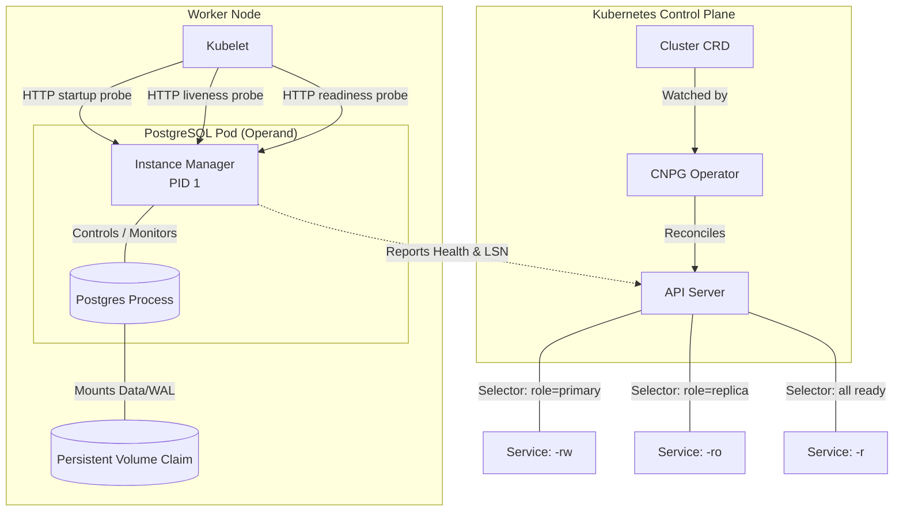
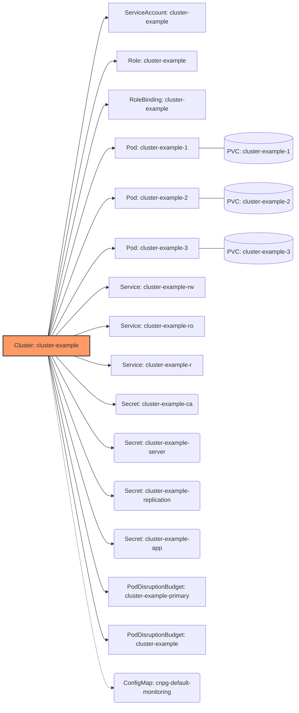

# CloudNativePG Architecture

> [!TIP]
> **Source Code Navigation:** The [`Cluster`](../api/v1/cluster_types.go)
> resource is the primary and most important Custom Resource Definition (CRD)
> provided by CloudNativePG. For a detailed mapping of the architectural
> components to their implementation, please see the
> [Source Code Reference](#source-code-reference) at the bottom of this page.

This document describes the design architecture of CloudNativePG, providing the
technical foundation for contributors and auditors to understand how the
operator ensures high availability and security for PostgreSQL workloads.
It focuses on core lifecycle and reconciliation; topics such as WAL archiving,
backup/restore pipelines, the plugin system, and webhook admission controllers
are outside its current scope.

## Design Philosophy

CloudNativePG follows the "Cloud Native" paradigm. Unlike PostgreSQL solutions
that delegate failover and replication management to additional components
(like Patroni, repmgr, or Stolon), CloudNativePG relies on the **Kubernetes
API** as the single source of truth.

### Key Principles

- **No Sidecars:** Management logic is integrated into the primary container as
  an **Instance Manager (PID 1)**.
- **Direct Pod Management:** Does **not** use `StatefulSets`, allowing for more
  granular control over individual instances.
- **Native Integration:** Leverages Kubernetes primitives (Pods, PVCs,
  Services, ConfigMaps, Secrets, StorageClasses, VolumeSnapshots) for all
  database cluster operations.
- **Security by Design:** Minimal attack surface by reducing the number of
  moving parts and using non-root, immutable application containers.

## Architectural Actors

The following diagram illustrates how the [`Cluster`](../api/v1/cluster_types.go)
resource orchestrates a PostgreSQL cluster in the Kubernetes ecosystem:

## Key Differentiator: Beyond StatefulSets

A core architectural distinction of CloudNativePG is that it does not use
`StatefulSets`. By managing `Pod` and `PVC` resources directly, the Operator
gains surgical control over the cluster state.

### 1. Granular Failover and Promotion

`StatefulSets` are bound by ordinal logic (0, 1, 2). CloudNativePG can promote
any replica based on the **Log Sequence Number (LSN)** reported by the Instance
Manager, ensuring the most up-to-date instance is always chosen as the new primary,
regardless of its name or index.

### 2. Managing "Sensitive" Parameters

In PostgreSQL, certain parameters (e.g., `max_connections`,
`max_prepared_transactions`, `max_wal_senders`) must be equal to or greater
on a standby than they are on the primary. If a standby starts with a lower
value, it will refuse to start or follow the primary.

Because CloudNativePG manages Pods directly, it can coordinate the update of
these parameters across the cluster in the correct order, ensuring that
standbys are always compatible with the primary during rolling updates or
configuration changes.

### 3. Synchronous Replication Control

The Operator dynamically manages `synchronous_standby_names` by watching Pod
status and updating the PostgreSQL configuration accordingly. Users configure
this via the declarative `synchronous` section, which supports priority-based
(`first`) and quorum-based (`any`) methods, allowing users to toggle between
`required` (strict durability) and `preferred` (availability-first) modes
without manual intervention.

## The Role of the Instance Manager (PID 1)

The Instance Manager is a Go binary that acts as the entry point for the
container. Its responsibilities include:

- **Postgres Lifecycle:** Initializing the cluster (`initdb`), starting the
  database, and managing clean shutdowns.
- **Self-Healing:** Participating in failover by executing `pg_ctl promote`
  when the Operator identifies it as the new leader.
- **Kubernetes Awareness:** Communicating directly with the K8s API to report
  status, replication lag, and LSN.

## Intelligent Probes

The Instance Manager provides a database-aware HTTP server for Kubelet probes:

- **Startup Probe:** Prevents restarts during `initdb`, recovery, or WAL
  replay.
- **Liveness Probe:** On primary instances, performs an isolation check: if both
  the API server and peer instances are unreachable (as determined by the
  configurable `IsolationCheck` settings), the probe fails, causing Kubelet to
  restart the Pod. Replicas always pass the liveness check.
- **Readiness Probe:** Ensures `pg_isready` succeeds on the primary and
  validates replication lag/hot-standby status on replicas before allowing
  traffic.

## Cluster Lifecycle: Orchestrated Resources

When a `Cluster` is created, the Operator generates several native objects to
manage the identity, security, and connectivity of the instances.

### 1. Bootstrap Phase: Initialization and Join Jobs

Before long-running Pods start, CloudNativePG uses temporary **Jobs** to
prepare the storage:

- **initdb:** Created for the first instance to initialize the PostgreSQL data
  directory on the PVC.
- **recovery:** Created when bootstrapping from a backup or volume snapshot,
  restoring the data directory for point-in-time recovery.
- **pg_basebackup:** Created when cloning from an external cluster via
  streaming replication.
- **join:** Created for subsequent replicas to clone data from the primary
  using `pg_basebackup`.

### 2. Operational Phase: Resource Hierarchy

For a basic 3-instance cluster (see [`cluster-example.yaml`](../docs/src/samples/cluster-example.yaml)),
the following hierarchy of objects is maintained:

## Label-Based Networking

Networking is purely label-driven. The Operator manages the
`cnpg.io/instanceRole` label:

1. **Primary:** Labeled as `primary`. The `-rw` Service selects this Pod.

2. **Replica:** Labeled as `replica`. The `-ro` Service selects these Pods.

3. **Failover:** When a new primary is promoted via `pg_ctl promote`, the
   Operator updates the labels. The Kubernetes API Server then automatically
   updates the **Endpoints** for the respective Services.

## Source Code Reference

The following table maps architectural components to their implementation in
the repository. The **Core** components form the backbone of the operator;
the remaining entries are peripheral CRDs for specific feature areas.

| Category | Component | Types Definition | Logic / Functions |
| --- | --- | --- | --- |
| **Core** | `Cluster` | [`cluster_types.go`](../api/v1/cluster_types.go) | [`cluster_funcs.go`](../api/v1/cluster_funcs.go) |
| **Core** | Instance Manager | N/A | [`pkg/management/postgres/`](../pkg/management/postgres/) |
| **Core** | Operator Controller | N/A | [`cluster_controller.go`](../internal/controller/cluster_controller.go) |
| **Image management** | `ClusterImageCatalog` | [`clusterimagecatalog_types.go`](../api/v1/clusterimagecatalog_types.go) | [`clusterimagecatalog_funcs.go`](../api/v1/clusterimagecatalog_funcs.go) |
| **Image management** | `ImageCatalog` | [`imagecatalog_types.go`](../api/v1/imagecatalog_types.go) | [`imagecatalog_funcs.go`](../api/v1/imagecatalog_funcs.go) |
| **Backup scheduling** | `Backup` | [`backup_types.go`](../api/v1/backup_types.go) | [`backup_funcs.go`](../api/v1/backup_funcs.go) |
| **Backup scheduling** | `ScheduledBackup` | [`scheduledbackup_types.go`](../api/v1/scheduledbackup_types.go) | [`scheduledbackup_funcs.go`](../api/v1/scheduledbackup_funcs.go) |
| **Pooling** | `Pooler` | [`pooler_types.go`](../api/v1/pooler_types.go) | [`pooler_funcs.go`](../api/v1/pooler_funcs.go) |
| **Database management** | `Database` | [`database_types.go`](../api/v1/database_types.go) | [`database_funcs.go`](../api/v1/database_funcs.go) |
| **Database management** | `Publication` | [`publication_types.go`](../api/v1/publication_types.go) | [`publication_funcs.go`](../api/v1/publication_funcs.go) |
| **Database management** | `Subscription` | [`subscription_types.go`](../api/v1/subscription_types.go) | [`subscription_funcs.go`](../api/v1/subscription_funcs.go) |
